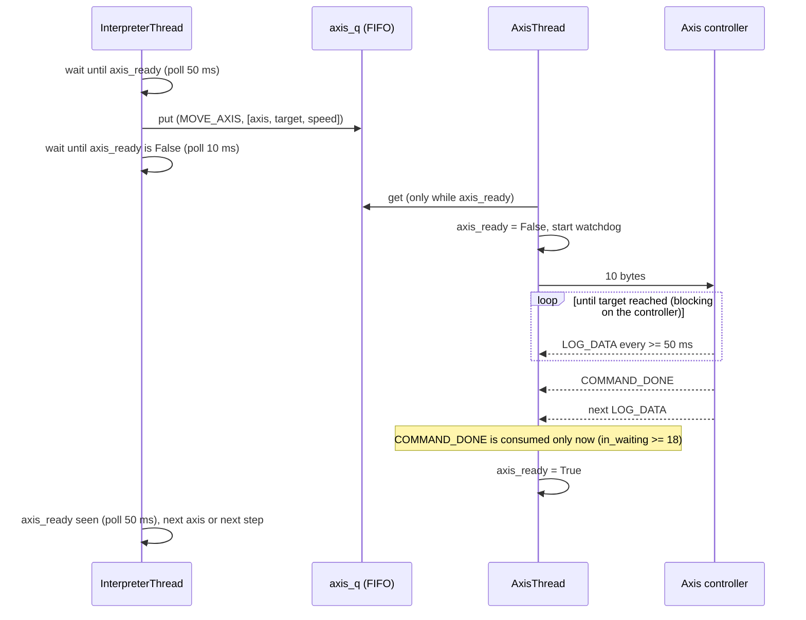

# Serial protocol: measurement terminal ↔ controllers

This document specifies the binary protocol between the PC measurement terminal
and the two Arduino Nano controllers of the SURF Test Unit. It describes the
protocol **as implemented**. No separate specification has ever existed: the
terminal and each firmware sketch hard-code their half of it. Where the
implementation is defective, this document says so and does not describe the
intended behaviour.

| Short name used below | File |
|---|---|
| `terminal.py` | `software/surf_terminal/terminal.py` |
| `SURF_nanoAxis_v5.ino` | `firmware/axis/SURF_nanoAxis_v5/SURF_nanoAxis_v5.ino` |
| `SURF_nanoHeating_v4.ino` | `firmware/heating/SURF_nanoHeating_v4/SURF_nanoHeating_v4.ino` |

`file:line` references point into these files; a bare `:NNN` refers to the
file cited most recently before it. Statements about third-party
libraries refer to the versions pinned in `.github/workflows/arduino-build.yml`
(AccelStepper 1.64, OneWire 2.3.8, DallasTemperature 4.0.6). They name the
library function concerned, because those libraries are not part of this
repository.

Related: [`blueprint-format.md`](blueprint-format.md) (the sequences that
generate most axis traffic), [`known-issues.md`](known-issues.md),
[`safety.md`](safety.md), [`data-dictionary.md`](data-dictionary.md).

## Contents

1. [Overview](#1-overview)
2. [Link layer and connection handling](#2-link-layer-and-connection-handling)
3. [Data types and encoding](#3-data-types-and-encoding)
4. [Axis link](#4-axis-link)
5. [Heater link](#5-heater-link)
6. [Framing and robustness](#6-framing-and-robustness)
7. [Timing reference](#7-timing-reference)
8. [Notes for reimplementers](#8-notes-for-reimplementers)

---

## 1. Overview

The terminal uses two independent point-to-point links, one USB-serial port per
controller. They share no framing, no addressing and no timing.

| | Axis link | Heater link |
|---|---|---|
| Controller | `SURF_nanoAxis_v5` (steppers H, V, R) | `SURF_nanoHeating_v4` (heating pads A, B) |
| PC port | `AXIS_PORT`, hard-coded per OS (`terminal.py:30-39`) | `HEAT_PORT` (`terminal.py:30-39`) |
| PC thread | `AxisThread` (`terminal.py:435-524`) | `HeatThread` (`terminal.py:527-613`) |
| PC → controller | 5 command types, 1–10 bytes | 2 command types, 5 bytes |
| Controller → PC | 18-byte telemetry frame, period ≥ 50 ms; 1-byte `COMMAND_DONE` | 13-byte telemetry frame, period ≥ 1000 ms |
| Acknowledgement | `COMMAND_DONE`, but not for every command and never negative | none |

## 2. Link layer and connection handling

| Parameter | Value | Source |
|---|---|---|
| Baud rate | 115 200 | `terminal.py:43` (used at `:450`, `:545`); `SURF_nanoAxis_v5.ino:254`; `SURF_nanoHeating_v4.ino:102` |
| Character format | 8 data bits, no parity, 1 stop bit | not set in code; pyserial and `Serial.begin(baud)` defaults |
| Flow control | none | not set in code; pyserial default |
| PC read timeout | 0.05 s | `terminal.py:450`, `:545` |
| PC write timeout | none (writes block) | not set in code; pyserial default |
| Byte order | little-endian | [§3](#3-data-types-and-encoding) |

**Connection.** Each PC thread opens its port once at start, sleeps 2 s and
flushes the input buffer (`terminal.py:450-452`, `:545-547`). The code does not
state the reason; presumably the pause waits out the reset that opening the
port triggers on Nano-class boards. Both controllers stream telemetry without
being asked, so the first byte read after the flush can lie anywhere inside a
frame ([§6.3](#63-synchronisation-and-resynchronisation)).

There is no handshake, identification or version check. Swapped ports are not
detected. The axis firmware defines `HELLO = 0` (`SURF_nanoAxis_v5.ino:12`),
but treats it as a no-op (`:308`), and the PC never sends it.

**Silent simulation fallback.** If a port cannot be opened, the thread prints
one console line and carries on without a port (`terminal.py:454-455`,
`:550-551`). This happens even though `SIMULATION_MODE` is `False`
(`terminal.py:67`), because the fallback branches test `ser is None`:

- **Axis:** every dequeued command is marked complete after a 0.5 s sleep
  (`terminal.py:517-520`). Positions are never updated and stay at their
  initial 0.0 (`terminal.py:343`).
- **Heater:** every 100 ms the temperatures are overwritten with the setpoints
  and both pads are flagged stable (`terminal.py:602-609`).

The telemetry CSV then contains fabricated but plausible values. Three archived
runs carry both signatures at once: all-zero positions, and
`Temp_A == Set_A`, `Temp_B == Set_B` in every row:

- `data/raw/2026-03-10/ETD_QA_PoP_SingleCouchOrientation_20260310_152831.csv`
- `data/raw/2026-08-06/ETsurface_easyQA_20260806_152005.csv`
- `data/raw/2026-08-21/ETD_QA_PoP_SingleCouchOrientation_20260821_093058.csv`

**Loss of the port at run time.** An exception outside the per-frame `try`
ends the thread after a console message (`terminal.py:523-524`, `:612-613`).
One example is `in_waiting` on a port that has disappeared (`:465`, `:555`).
Nothing restarts the thread. On the axis link the watchdog runs inside the same
loop ([§4.6](#46-commandacknowledge-handshake)), so a pending
`axis_ready = False` is never cleared, and blueprint moves wait indefinitely.

## 3. Data types and encoding

| Type | Size | Encoding |
|---|---|---|
| `i8` | 1 byte | two's complement, signed |
| `u8` | 1 byte | unsigned; used for header values and the status bit field |
| `i32` | 4 bytes | two's complement, signed, **little-endian** (least significant byte first) |

- **PC:** `write_i8`, `write_i32`, `read_i8` and `read_i32` use
  `int.to_bytes` / `int.from_bytes` with `'little', signed=True`
  (`terminal.py:365-374`).
- **Axis firmware:** explicit shifts, least significant byte first
  (`SURF_nanoAxis_v5.ino:105-120`).
- **Heater firmware:** copies the in-memory bytes of a `long`
  (`SURF_nanoHeating_v4.ino:51-57`). `long` is 32-bit little-endian on AVR, so
  here the byte order comes from the microcontroller, not from the code.
- **No floating-point values cross the wire.** Physical quantities are scaled
  integers: motor steps, steps/s and 0.01 °C. The mechanical scale factors are
  compiled into both ends: 800 steps/mm and 16.156 steps/° (`terminal.py:68-69`,
  `SURF_nanoAxis_v5.ino:39-40`). The thermal calibration exists only on the PC
  (`terminal.py:55-64`).
- **`millis()`** is an unsigned 32-bit counter carried in a signed `i32` field.
  It becomes negative when read as signed after 2³¹ ms (≈ 24.9 days) and wraps
  after 2³² ms (≈ 49.7 days). The PC discards it anyway
  ([§6.5](#65-discarded-information)).

Robustness of the primitives:

- The PC's `read_i8`/`read_i32` do not check how many bytes `ser.read()`
  returned. On a timeout `ser.read()` returns fewer bytes, and `int.from_bytes`
  silently decodes the short buffer; an empty buffer decodes as 0
  (`terminal.py:371-374`). In normal operation reads are gated on `in_waiting`
  ([§6.2](#62-read-gating-and-the-delayed-command_done)), so short reads should
  not occur.
- The axis firmware's `read_i8`/`read_i32` busy-wait with no timeout
  (`SURF_nanoAxis_v5.ino:112-120`). While waiting, the controller neither steps
  nor sends telemetry.
- The PC's `write_i8`/`write_i32` raise `OverflowError` for out-of-range values
  (`int.to_bytes`). The exception is caught (`terminal.py:512-515`), but by then
  the bytes of the same command written before the failing field have already
  gone out.

---

## 4. Axis link

### 4.1 Opcodes

| Value | Firmware name (`OrderID`) | PC constant (`AxisOrder`) | Direction | Total length (bytes) | Reply |
|---|---|---|---|---|---|
| 0 | `HELLO` | — (not defined) | PC → axis | 1 | none |
| 1 | `MOVE_AXIS` | `MOVE_AXIS` | PC → axis | 10 | `COMMAND_DONE`, **also if the move is rejected** |
| 2 | `HOME_AXIS` | `HOME_AXIS` | PC → axis | 2 | `COMMAND_DONE`, **also if homing fails** |
| 3 | `STOP_ALL` | `STOP_ALL` | PC → axis | 1 | **none** |
| 4 | `COMMAND_DONE` | `COMMAND_DONE` | axis → PC | 1 | — |
| 5 | `SET_BACKLASH` | `SET_BACKLASH` | PC → axis | 2 | `COMMAND_DONE` |
| 6 | `SET_ZERO` | `SET_ZERO` | PC → axis | 2 | `COMMAND_DONE` |
| 10 (`0x0A`) | `LOG_DATA` | `LOG_DATA` | axis → PC | 18 | — |

Sources: `SURF_nanoAxis_v5.ino:11-20` and `terminal.py:73-80`. The two
definitions agree for every value both define.

Axis identifiers (`SURF_nanoAxis_v5.ino:22-26`; PC mapping at
`terminal.py:727`, `:1205`, `:1221`, `:1247`):

| Value | Axis | Wire unit | Scale |
|---|---|---|---|
| 0 | H, horizontal slide | motor steps | 800 steps/mm |
| 1 | V, vertical slide | motor steps | 800 steps/mm |
| 2 | R, rotation stage | motor steps | 16.156 steps/° |

### 4.2 PC-side argument encoding

The PC has no per-opcode encoder. Commands are queued as `(opcode, [args])`
tuples and serialised **positionally** (`terminal.py:504-510`):

1. the opcode, as `i8`;
2. if the argument list is not empty, its **first** element as `i8`;
3. **every further** element as `i32`.

The byte layout of a command is therefore decided by the call site that builds
its argument list. Nothing on the PC side knows that `MOVE_AXIS` takes three
arguments or `HOME_AXIS` one. A list of the wrong shape is transmitted without
complaint and desynchronises the firmware parser
([§6.4](#64-controller-side-parsing)). An opcode whose first argument is not a
single byte cannot be sent without changing the generic encoder.

| Opcode | Enqueued by | Argument list | Source |
|---|---|---|---|
| `MOVE_AXIS` | blueprint `move` step | `[axis, int(target × scale), int(speed × scale)]` | `terminal.py:739` |
| `MOVE_AXIS` | console `m <h\|v\|r> <pos> <speed>` | same; the only range check on the PC | `terminal.py:1210-1224` |
| `MOVE_AXIS` | console `m zp [speed]` | three commands, R then V then H, target 0 | `terminal.py:1198-1207` |
| `HOME_AXIS` | console `h all` | three commands, V then R then H | `terminal.py:1228-1243` |
| `HOME_AXIS` | console `h <h\|v\|r>` | `[axis]` | `terminal.py:1246-1250` |
| `SET_ZERO` | console `set <h\|v\|r> zero` | `[axis]` | `terminal.py:1265-1273` |
| `SET_BACKLASH` | console `backlash on` / `backlash off` | `[1]` / `[0]` | `terminal.py:1290-1295` |
| `STOP_ALL` | STOP ALL button | `[]` | `terminal.py:1110-1112` |

### 4.3 Commands (PC → axis controller)

#### `MOVE_AXIS` (1), 10 bytes

| Offset | Size | Type | Field | Encoding |
|---|---|---|---|---|
| 0 | 1 | `i8` | opcode | `0x01` |
| 1 | 1 | `i8` | axis | 0 = H, 1 = V, 2 = R |
| 2 | 4 | `i32` | target | absolute position in motor steps: `int(mm × 800)` or `int(deg × 16.156)`, truncated toward zero |
| 6 | 4 | `i32` | speed | maximum speed in steps/s: `int(mm_per_s × 800)` or `int(deg_per_s × 16.156)`, truncated toward zero |

Example: H to −10 mm at 5 mm/s → `01 00 C0 E0 FF FF A0 0F 00 00` (target
−8000, speed 4000). R to 1° at 5 °/s → `01 02 10 00 00 00 50 00 00 00`
(target 16 steps = 0.9903°, speed 80 steps/s = 4.95 °/s).

Firmware behaviour (`SURF_nanoAxis_v5.ino:310-379`):

1. The three fields are read with blocking reads (`:311-313`).
2. The speed is clamped **from above only**: 40 000 steps/s (50 mm/s) for H
   and V, 1 454 steps/s (90 °/s) for R (`:316-320`, constants `:42-43`,
   `:50-51`). There is no lower clamp.
3. The target is checked in steps by `isTargetSafe` (`:143-156`, limits
   `:55-70`, each a `(long)` truncation of a float product):

   | Axis | Physical limits | Step limits (inclusive) | Additional condition |
   |---|---|---|---|
   | H | −45 … +25 mm | −36 000 … 20 000 | — |
   | V | −35 … +50 mm | −28 000 … 40 000 | — |
   | R | −30 … +120° | −484 … 1 938 | R must have been initialised since reset by `HOME_AXIS` or `SET_ZERO` with axis 2 (`:99`, `:152`, `:394`, `:423`) |
   | any other value | — | — | always rejected (`:155`) |

4. If the target passes, the firmware first applies backlash take-up, but only
   when compensation is enabled by `SET_BACKLASH`, the axis has a non-zero
   `backlash_steps` entry (in v5 only R, 4 steps), and the direction reverses.
   The logical position is restored afterwards (`:46`, `:335-361`). Then it
   calls `setMaxSpeed(speed)` and `moveTo(target)` and runs a **blocking** loop
   until the target is reached, emitting telemetry on the 50 ms schedule
   (`:365-374`).
   Acceleration is not part of the command. It stays at the values set in
   `setup()`: 80 mm/s² (64 000 steps/s²) for H and V, and 40 °/s² (≈ 646 steps/s²)
   for R (`:86-87`, `:263-267`).
5. **`COMMAND_DONE` is written unconditionally** (`:377`). The write sits after
   the closing brace of `if (limits_ok) { … }` (`:326-376`). A move rejected by
   the limit check, a move of the uninitialised R axis and a move with an invalid
   axis number are therefore acknowledged exactly like a completed move. The
   acknowledgement carries no status.

Consequences:

- While the loop at `:368-374` runs, the controller reads no serial input. Every
  command sent during a move, `STOP_ALL` included, stays in the receive buffer
  until the move has finished.
- The move loop does not read the driver alarm inputs. A driver fault neither
  ends the move nor shows up in the reply. The homing loop does check them
  (`:185`).
- Reported positions are AccelStepper step counters (`currentPosition()`), i.e.
  the steps sent to the drivers. They are not measurements: the axes have no
  encoder feedback.
- A speed of 0 steps/s is passed to `setMaxSpeed()` unchanged. AccelStepper then
  computes an infinite minimum step interval (`setMaxSpeed`, `computeNewSpeed`),
  and in practice the loop never finishes. A positive blueprint speed that
  truncates to 0 has the same effect: any R speed below 1/16.156 ≈ 0.062 °/s.
  The blueprint schema excludes such values (`moveStep.speed` in
  `blueprints/schema/blueprint.schema.json`).
- **Step rates above about 4 000 steps/s are not reached on H and V.**
  AccelStepper's documentation gives about 4 000 steps/s as the fastest rate it
  supports reliably on a 16 MHz Arduino (`AccelStepper.h`, section
  "Performance"). In the archived telemetry, H and V cruise at 5.0–5.15 mm/s
  (≈ 4 000–4 120 steps/s) whether 20 or 50 mm/s was commanded. The firmware's
  40 000 steps/s clamp is therefore never the binding limit for the linear
  axes. R stays below 1 454 steps/s and is not affected. For details and the
  analysis see
  [`blueprint-format.md`](blueprint-format.md#31-move).

#### `HOME_AXIS` (2), 2 bytes

| Offset | Size | Type | Field | Encoding |
|---|---|---|---|---|
| 0 | 1 | `i8` | opcode | `0x02` |
| 1 | 1 | `i8` | axis | 0 = H, 1 = V, 2 = R |

Firmware behaviour (`SURF_nanoAxis_v5.ino:381-403`):

- **H, V:** endstop homing in `doHomingAxis` (`:204-241`):
  1. back off if the switch is already pressed;
  2. search at a nominal 10 mm/s;
  3. two slow re-approaches at 2 mm/s;
  4. declare the switch position to be +33 mm (H) or +62 mm (V) (`:80-81`, `:231`);
  5. drive to 0 at a nominal 15 mm/s (`:234-239`).

  Every search phase aborts after 20 s (`:78`, `:198`) or on a driver alarm
  (`:185`).
- **R:** no motion. The current position is declared 0 and R moves are enabled
  (`:392-396`). R has no endstop and no alarm input (`:35`).
- Status bit 0 is set in every frame sent during the command (`:383`, `:399`,
  `:167`).
- **`COMMAND_DONE` is written unconditionally** (`:401`). The local `success`
  flag (`:384`) is never transmitted, so a failed homing cannot be told apart
  from a successful one on the wire. An invalid axis number does nothing and is
  acknowledged too.

#### `STOP_ALL` (3), 1 byte

| Offset | Size | Type | Field | Encoding |
|---|---|---|---|---|
| 0 | 1 | `i8` | opcode | `0x03` |

Firmware behaviour (`SURF_nanoAxis_v5.ino:429-432`): calls `stop()` on all
three steppers and writes **no reply**. Of the commands the PC actually sends,
`STOP_ALL` is the only one whose handler never writes `COMMAND_DONE`. For the
other cases without a reply, see
[below](#commands-received-during-a-driver-alarm).

In v5 the command has no practical effect:

- **Controller:** every handler that moves a stepper runs the motion to
  completion before the next opcode is read. By the time `STOP_ALL` is read,
  the steppers are stationary, and AccelStepper's `stop()` does nothing when the
  current speed is 0 (`AccelStepper::stop`). The only exception found in the
  source is main-loop motion after an aborted homing (see
  [`COMMAND_DONE`](#command_done-4-1-byte)).
- **PC:** the STOP ALL button puts the command into the same FIFO queue as
  every other axis command (`terminal.py:1112`). It is transmitted only after
  all earlier commands have been sent and acknowledged (`terminal.py:489-493`).
- **After transmission** the PC waits for an acknowledgement that never comes.
  `axis_ready` stays `False` until the 60 s watchdog releases it
  (`terminal.py:459-462`). For that minute no other axis command is sent, and
  blueprint `move` steps wait.

#### `SET_BACKLASH` (5), 2 bytes

| Offset | Size | Type | Field | Encoding |
|---|---|---|---|---|
| 0 | 1 | `i8` | opcode | `0x05` |
| 1 | 1 | `i8` | state | 1 = compensation on; any other value = off |

Firmware (`SURF_nanoAxis_v5.ino:405-410`): sets `backlash_on` and replies
`COMMAND_DONE`. The setting is volatile (default off, `:45`) and cannot be read
back. No output file records it.

#### `SET_ZERO` (6), 2 bytes

| Offset | Size | Type | Field | Encoding |
|---|---|---|---|---|
| 0 | 1 | `i8` | opcode | `0x06` |
| 1 | 1 | `i8` | axis | 0 = H, 1 = V, 2 = R |

Firmware (`SURF_nanoAxis_v5.ino:412-427`): declares the axis's current position
to be 0 and clears its backlash direction memory. For R it also enables R moves
(`:423`). It replies `COMMAND_DONE`, also for an invalid axis number.

#### `HELLO` (0) and unknown opcodes

`HELLO` is consumed and ignored (`SURF_nanoAxis_v5.ino:308`). So is any value
that is not in the opcode table: the `switch` has no `default` (`:307-433`).
Neither produces a reply, and the next byte is interpreted as a new opcode.

#### Commands received during a driver alarm

At the top of every main-loop iteration the firmware sets `isAlarmState` while
either driver alarm input (H or V) is low (`SURF_nanoAxis_v5.ino:273-275`).
While it is set, `MOVE_AXIS` and `HOME_AXIS` are read **including their
arguments** and discarded **without `COMMAND_DONE`** (`:300-305`). The PC is
then blocked until the watchdog fires, as after `STOP_ALL`. `SET_BACKLASH`,
`SET_ZERO` and `STOP_ALL` are processed normally.

### 4.4 Messages (axis controller → PC)

#### `LOG_DATA` (10), 18 bytes

| Offset | Size | Type | Field | Unit / encoding | Use on the PC |
|---|---|---|---|---|---|
| 0 | 1 | `u8` | header | `0x0A` | frame recognition |
| 1 | 4 | `i32` | `millis()` | ms since controller reset (unsigned counter) | **read and discarded** (`_millis`, `terminal.py:469`) |
| 5 | 4 | `i32` | H position | motor steps | ÷ 800 → `state.pos['h']`, mm (`:470`, `:476`) |
| 9 | 4 | `i32` | V position | motor steps | ÷ 800 → `state.pos['v']`, mm (`:471`, `:477`) |
| 13 | 4 | `i32` | R position | motor steps | ÷ 16.156 → `state.pos['r']`, degrees (`:472`, `:478`) |
| 17 | 1 | `u8` | status | bit field, see below | **read and discarded** (`_stat`, `:473`) |

The frame is built by `sendStatusLog()` (`SURF_nanoAxis_v5.ino:159-173`).

Status bits (`SURF_nanoAxis_v5.ino:166-172`):

| Bit | Meaning when set | Source |
|---|---|---|
| 0 | homing in progress | `isHoming` (`:383`, `:399`) |
| 1 | H driver alarm input active (pin low), read while the frame is built | `PIN_ALM_H` (`:168`) |
| 2 | V driver alarm input active (pin low), read while the frame is built | `PIN_ALM_V` (`:169`) |
| 3 | alarm state as last evaluated at the top of the main loop | `isAlarmState` (`:170`, `:273-275`) |
| 4–7 | always 0 | — |

Example: `millis()` = 123 456, H = −8000 steps (−10 mm), V = 0, R = 16 steps
(0.9903°), status 0:

```
0A  40 E2 01 00  C0 E0 FF FF  00 00 00 00  10 00 00 00  00
hdr millis       H            V            R            status
```

**Cadence.** A frame is sent whenever a check of
`millis() - lastLogTime >= LOG_INTERVAL_MS` (50 ms, `SURF_nanoAxis_v5.ino:96`)
succeeds. The timer is then re-armed with the current time
(`lastLogTime = millis()`), not advanced by 50 ms. The check runs in the main
loop (`:282`), the move loop (`:370-373`), the homing search loop (`:182`) and
the homing back-off and return loops (`:211`, `:238`). The period is therefore
**at least 50 ms (at most 20 Hz)**, and jitter accumulates instead of averaging
out. Longer gaps occur where no check runs:

- the backlash take-up loop (`:349-351`);
- the 100 ms `delay()` between homing re-approaches (`:224`);
- while the controller busy-waits for argument bytes (`:112-120`).

At 20 Hz the frames occupy 360 bytes/s, about 3 % of the link capacity
(11 520 bytes/s at 115 200 baud, 8N1).

The frames themselves are not recorded. The telemetry CSV is written by
`LoggerThread`, which samples the latest decoded state every 0.1 s plus
processing time (`terminal.py:379`, `:414-430`). Across 117 archived telemetry
CSVs the median sampling rate is 9.25 Hz.

#### `COMMAND_DONE` (4), 1 byte

| Offset | Size | Type | Field | Encoding |
|---|---|---|---|---|
| 0 | 1 | `u8` | header | `0x04` |

There is no payload. The message identifies neither the command it answers nor
its outcome. It is sent in two situations:

1. **As a reply** to `MOVE_AXIS` (`SURF_nanoAxis_v5.ino:377`), `HOME_AXIS`
   (`:401`), `SET_BACKLASH` (`:408`) and `SET_ZERO` (`:425`). In every case it
   is written unconditionally.
2. **Unsolicited**, by the main loop's motion-edge detector (`:284-293`). It
   fires when a 50 ms tick finds the steppers stationary after they were moving
   at the previous tick. The detector sits inside the telemetry `if` block, so
   it only runs directly after a frame.

   All v5 command handlers finish their motion before returning. Motion in the
   main loop therefore needs a handler that returns with a target that differs
   from the position. The only such path in the v5 source is an aborted homing
   (20 s timeout, `:198`, or driver alarm, `:185`). The search phases advance
   the position with `runSpeed()`, which does not update the target (`:200`,
   `:216-227`). What the main loop's `run()` (`:280`) then does with the stale
   target is up to AccelStepper and has not been verified on hardware. If it
   moves the axis, an extra `COMMAND_DONE` follows, and the PC cannot tell it
   from a reply.

On the controller side, byte alignment is preserved. `sendStatusLog()` writes
each frame in one uninterrupted sequence, and every `COMMAND_DONE` write sits
outside it, so a `COMMAND_DONE` always lies between two complete frames.

### 4.5 PC receiver and sender (`AxisThread`)

One loop iteration (`terminal.py:457-521`):

| Step | Action | Lines |
|---|---|---|
| 1 | **Watchdog:** if `axis_ready` is `False` and the last command was dequeued more than 60 s ago, set `axis_ready = True` | `:459-462` |
| 2 | **Receive:** only if `in_waiting ≥ 18`, read one byte. `0x0A`: read 17 more bytes and update `state.pos`. `0x04`: set `axis_ready = True`. Any other value: the byte is dropped. On an exception: `reset_input_buffer()` | `:465-485` |
| 3 | **Send:** if `axis_ready` is set and the queue is not empty, dequeue one command, set `axis_ready = False` and the watchdog timestamp, then write the command | `:488-510` |
| 4 | On a write exception: log it and set `axis_ready = True` | `:512-515` |
| 5 | Sleep 10 ms | `:521` |

Each iteration consumes at most one frame or one stray byte, so at most about
100 of either per second.

### 4.6 Command/acknowledge handshake

All axis commands are serialised through one shared flag, `state.axis_ready`
(initially `True`, `terminal.py:344`). A blueprint move runs as follows
(interpreter side `terminal.py:731-747`):



Properties of this handshake:

- **One command in flight.** Blueprint steps, console commands and the STOP ALL
  button share the queue and the flag. The interpreter cannot tell whose
  `COMMAND_DONE` released it.
- **An acknowledgement means only that the controller finished handling some
  command.** It does not mean the command was executed
  ([§4.3](#43-commands-pc--axis-controller)).
- **A command without an acknowledgement blocks the link for 60 s.** This
  applies to `STOP_ALL`, to commands dropped during a driver alarm and to a move
  that never finishes.
- **The watchdog cannot tell a lost acknowledgement from a slow command.** If a
  command takes longer than 60 s, the next command is sent while the controller
  is still busy; it waits in the controller's receive buffer. The late
  `COMMAND_DONE` is then credited to that next command. From then on each
  acknowledgement is credited to the command after the one it belongs to, until
  the queue has drained.
- **Pickup is detected by polling.** The interpreter first waits for
  `axis_ready` to turn `False` (`terminal.py:742-743`) and then for it to turn
  `True` again (`:746-747`). Suppose a command's entire busy period falls
  between two 10 ms polls, as could happen for a zero-length or rejected move,
  which is acknowledged at once. The interpreter then keeps waiting at
  `:742-743`, and that loop has no timeout. The busy period always lasts at
  least the `AxisThread`'s own 10 ms sleep plus the wait for the next telemetry
  frame, so the window for this race is narrow. It has not been observed.
- **Latency.** `COMMAND_DONE` takes effect only after the next telemetry frame
  has arrived behind it
  ([§6.2](#62-read-gating-and-the-delayed-command_done)). That is up to one
  telemetry period (≥ 50 ms) plus USB and loop latency after the controller
  finished.

---

## 5. Heater link

### 5.1 Opcodes

| Value | Firmware name (`HeatOrder`) | PC constant (`HeatOrder`) | Direction | Total length (bytes) | Reply |
|---|---|---|---|---|---|
| 1 | `CMD_SET_A` | `SET_A` | PC → heater | 5 | **none** |
| 2 | `CMD_SET_B` | `SET_B` | PC → heater | 5 | **none** |
| 10 (`0x0A`) | `LOG_DATA` | `LOG_DATA` | heater → PC | 13 | — |

Sources: `SURF_nanoHeating_v4.ino:12-16` and `terminal.py:83-86`. The PC sender
does not use the `HeatOrder` constants. It writes the pad index from its queue
(1 or 2) directly as the opcode (`terminal.py:589`, `:596`). The values happen
to coincide.

### 5.2 `SET_A` / `SET_B` (1 / 2), 5 bytes

| Offset | Size | Type | Field | Encoding |
|---|---|---|---|---|
| 0 | 1 | `i8` | opcode | `0x01` = pad A, `0x02` = pad B |
| 1 | 4 | `i32` | setpoint | **pad-internal (sensor) temperature** in 0.01 °C: `int((T_surface × 1.170 − 3.500) × 100)` |

The operator and blueprints specify surface temperatures. The PC converts them
with the linear calibration `T_internal = 1.170 · T_surface − 3.500`
(`terminal.py:52-60`, applied at `:597-598`). `int()` truncates, so 35 °C gives
37.449 999… and is sent as `3744`.

| Surface setpoint | Wire value | Bytes (pad A) |
|---|---|---|
| 32 °C | 3394 | `01 42 0D 00 00` |
| 35 °C | 3744 | `01 A0 0E 00 00` |
| 36 °C | 3861 | `01 15 0F 00 00` |
| 0 °C (blueprint "off") | −350 | `01 A2 FE FF FF`, clamped to 0 °C by the firmware |

Firmware behaviour (`SURF_nanoHeating_v4.ino:133-147`):

- Nothing is read until at least 5 bytes are buffered (`:133`).
- If the first byte is neither 1 nor 2, the **entire receive buffer** is
  discarded (`:136-139`). This is the heater's only resynchronisation
  mechanism.
- The value is divided by 100, clamped to 0 … 65 °C internal (`:141-143`,
  `MAX_SAFE_TEMP` at `:24`) and stored as the addressed pad's setpoint
  (`:145-146`).
- **There is no acknowledgement and no way to read the setpoint back.**

The two ends start from different setpoints: the firmware from 0.0 °C
(`SURF_nanoHeating_v4.ino:41-42`), the PC from 25.0 °C (`terminal.py:349`).
Until the first SET command after power-up, the `Set_A`/`Set_B` columns of the
telemetry CSV read 25.0, although the controller's setpoint is 0 °C and the
heaters are off.

The GUI fields and the console `t` command accept only 10–50 °C
(`terminal.py:1139`, `:1258`). Blueprint `heat` steps are not range-checked on
the PC. The PC sender drains its whole queue on every 100 ms iteration, with no
readiness gating (`terminal.py:588-600`).

### 5.3 `LOG_DATA` (heater, 10), 13 bytes

| Offset | Size | Type | Field | Unit / encoding | Use on the PC |
|---|---|---|---|---|---|
| 0 | 1 | `u8` | header | `0x0A` | frame recognition |
| 1 | 4 | `i32` | `millis()` | ms since controller reset | **read and discarded** (`terminal.py:561`) |
| 5 | 4 | `i32` | pad A temperature | sensor (internal) temperature in 0.01 °C, `(long)(T × 100)`, truncated | `(v/100 + 3.5) / 1.17` → `state.temp['a']`, surface °C (`:562`, `:566`) |
| 9 | 4 | `i32` | pad B temperature | as pad A | → `state.temp['b']` (`:563`, `:567`) |

The frame has no status byte and is sent at
`SURF_nanoHeating_v4.ino:125-128`.

Example: `millis()` = 60 000, A = 36.50 °C and B = 33.94 °C internal gives
`0A 60 EA 00 00 42 0E 00 00 42 0D 00 00`. The PC displays and logs 34.19 °C and
32.00 °C.

**Cadence and sample age.**

- A frame is sent whenever `now - lastUpdate >= 1000` (`:116`). The timer is
  re-armed with the loop-entry time (`:113`, `:129`). The period is therefore
  **≥ 1000 ms, about 1 Hz**. In the archived CSVs, successive temperature
  changes are a median 1.07 s apart.
- The DS18B20 sensors run in non-blocking mode (`:107-108`). Each cycle first
  reads the result of the conversion started in the *previous* cycle
  (`:117-118`), then starts the next conversion (`:122-123`), then transmits.
  Each frame therefore carries a conversion that was requested about one period
  earlier. The first frame after a reset carries values read before any
  conversion was requested.
- For a sensor that is not found on the bus, DallasTemperature returns −127 °C
  (`getTempCByIndex`, `DEVICE_DISCONNECTED_C`), which is sent as `−12700`. The
  firmware switches that heater off (`:61-64`). The PC does not recognise the
  value and reports −105.6 °C.

**PC receiver** (`HeatThread`, `terminal.py:553-611`): every 100 ms, if
`in_waiting ≥ 13`, it reads one byte. `0x0A`: read 12 more bytes, convert, append
to the stability history and recompute the stability flags. Any other value:
the byte is dropped. On an exception: `reset_input_buffer()`.

**Stability flag** (`terminal.py:569-580`): a pad is flagged stable when its
history holds 120 samples and all of them lie within ±0.2 °C of the pad's
*current* setpoint. At about 1 Hz this is a window of about 120 s. The comment at
`terminal.py:353` says 20 s, which does not match the code. The history is not
cleared when the setpoint changes, and the flag is recomputed only when a frame
arrives. [`blueprint-format.md`](blueprint-format.md#33-heat) describes the
consequences for blueprint `heat` steps.

---

## 6. Framing and robustness

### 6.1 Summary

| Property | Axis link | Heater link |
|---|---|---|
| Sync word / start-of-frame marker | none; the header is an ordinary byte value | none |
| Length field | none; the length is implied by the header value | none |
| Checksum / CRC | none | none |
| Sequence number / command identity | none | none |
| Negative acknowledgement | none: failures are acknowledged as success, or not at all | none; no acknowledgement at all |
| PC read gating | `in_waiting ≥ 18` before any read, including for the 1-byte `COMMAND_DONE` | `in_waiting ≥ 13` |
| PC resynchronisation | accidental only: one byte dropped per loop iteration (≈ 10 ms) | accidental only: one byte per iteration (100 ms) |
| Controller-side resynchronisation | none; blocking reads without timeout | discard the whole receive buffer on an invalid opcode |
| Controller timestamp | sent in every frame, discarded by the PC | sent in every frame, discarded by the PC |
| Controller status | sent in every frame (status byte), discarded by the PC | not sent |

### 6.2 Read gating and the delayed `COMMAND_DONE`

Both PC receivers read only once a full frame's worth of bytes is buffered
(`terminal.py:465`, `:555`). The axis receiver applies the same threshold of 18
to the 1-byte `COMMAND_DONE`. A `COMMAND_DONE` that arrives on its own stays in
the buffer until the **next telemetry frame has arrived completely behind it**:
up to 50 ms later, plus transport latency. Only then is the byte consumed and
`axis_ready` released. If telemetry stops, for example because the controller
is busy-waiting for argument bytes ([§3](#3-data-types-and-encoding)), a
`COMMAND_DONE` already sitting in the buffer is not processed at all.

### 6.3 Synchronisation and resynchronisation

Neither frame type contains a synchronisation pattern. The header values `0x0A`
and `0x04` also occur as ordinary payload bytes. For example, V = 3.3 mm is
2640 steps, encoded `50 0A 00 00`. H = 1.28 mm is 1024 steps, encoded
`00 04 00 00`. A pad temperature of 25.60 °C is `00 0A 00 00`.

A PC receiver is aligned when its read position is on a header. It becomes
misaligned when it starts reading mid-frame, which can happen at every
connection ([§2](#2-link-layer-and-connection-handling)), or when a byte is
lost or corrupted. A misaligned receiver drops one byte per loop iteration
until it reads a byte equal to `0x0A`, or `0x04` on the axis link:

- **A genuine header:** the receiver is aligned again.
- **A payload byte equal to `0x0A`:** it consumes 18 bytes (heater: 13) as a
  frame and publishes garbage positions (temperatures). The frame length equals
  the spacing of frames in the byte stream, so its next read position is the
  **same offset in the next frame**. If that byte has the same value there, as
  position bytes do while the axes stand still, the receiver stays misaligned
  and keeps publishing garbage for as long as the value persists.
- **A payload byte equal to `0x04` (axis link):** it sets
  `axis_ready = True`. This spurious acknowledgement can release the interpreter
  before the current move has finished.

The exception handler (`reset_input_buffer()`, `terminal.py:484-485`,
`:582-585`) does not help here. Decoding garbage raises no exception, and
neither do short reads ([§3](#3-data-types-and-encoding)). The handler fires
only on OS-level serial errors.

Garbage positions go into `state.pos` and from there into the telemetry CSV.
The archived telemetry was checked for positions outside the mechanical
envelope. The only ones found are the +30 mm H excursions in four of the
`data/raw/2026-02-pilot/ETD_QA_BasicPoP_20260217_*.csv` files. These exceed the
current firmware limit and were recorded before the v5 sketch was first
committed (2026-03-09). Misframing is therefore not known to have affected the
archived data, but the protocol offers no way to rule it out.

### 6.4 Controller-side parsing

- **Axis controller.** It reads an opcode as soon as one byte is available and
  then busy-waits for the argument bytes that opcode implies
  (`SURF_nanoAxis_v5.ino:297-313`, `:112-120`). There is no timeout and no
  resynchronisation. A lost, extra or corrupted byte shifts the interpretation
  of everything that follows: once the parser is out of step, a target byte
  equal to `0x01` is taken as the start of a new `MOVE_AXIS`. If the PC sends a
  truncated command, for example because an exception occurs between the
  separate `write` calls (`terminal.py:504-510`), the controller waits for the
  missing bytes and takes them from the next command.
- **Heater controller.** It reads only when ≥ 5 bytes are available. If the
  first byte is not 1 or 2, it discards its entire receive buffer
  (`SURF_nanoHeating_v4.ino:133-139`). This recovers from garbage, but also
  silently discards any valid command buffered behind it. A shifted frame whose
  first byte happens to be 1 or 2 is accepted with a garbage setpoint, clamped
  to 0–65 °C.

### 6.5 Discarded information

Every axis frame carries the controller's `millis()` and a status byte (homing
in progress, driver alarms). Every heater frame carries `millis()`. The
terminal reads these fields only to skip over them (`terminal.py:469`, `:473`,
`:561`). As a result:

- positions and temperatures are timed by the PC, at the moment the logger
  samples the shared state, not at the moment the controller produced them;
- driver alarms and homing leave no trace in any output file;
- controller resets, which would show as `millis()` jumping backwards, go
  undetected.

---

## 7. Timing reference

| Quantity | Value | Source |
|---|---|---|
| Axis telemetry period | ≥ 50 ms (≤ 20 Hz), re-armed after each frame | `SURF_nanoAxis_v5.ino:96`, `:282` |
| Heater telemetry period | ≥ 1000 ms (≈ 1 Hz); archived median 1.07 s | `SURF_nanoHeating_v4.ino:116` |
| Age of a heater reading | ≈ one period | `SURF_nanoHeating_v4.ino:117-123` |
| PC axis loop | 10 ms sleep per iteration | `terminal.py:521` |
| PC heater loop | 100 ms sleep per iteration | `terminal.py:611` |
| Telemetry CSV sampling | 0.1 s sleep plus processing time; archived median 9.25 Hz | `terminal.py:379`, `:430` |
| Delay before `COMMAND_DONE` is consumed | until the next axis frame is complete (≤ 50 ms plus transport) | `terminal.py:465` |
| Axis watchdog | 60 s after a command was dequeued | `terminal.py:460` |
| Settle time after opening a port | 2 s, then input flush | `terminal.py:451-452`, `:546-547` |
| Heater stability criterion | last 120 samples (≈ 120 s) within ±0.2 °C of the setpoint | `terminal.py:354-355`, `:576-578` |
| Realised H/V cruise speed | ≈ 5.0–5.15 mm/s (≈ 4 000 steps/s) regardless of the commanded speed | archived telemetry; AccelStepper performance note |

---

## 8. Notes for reimplementers

The constraints below follow from the terminal's implementation. They apply to
anyone replacing a controller while keeping the unmodified terminal.

An **axis controller** must:

- send 18-byte `LOG_DATA` frames continuously, also while idle. Without them a
  `COMMAND_DONE` is never consumed ([§6.2](#62-read-gating-and-the-delayed-command_done));
- send exactly one `COMMAND_DONE` per `MOVE_AXIS`, `HOME_AXIS`, `SET_BACKLASH`
  and `SET_ZERO`, only once the action is complete, and only between frames;
- send no other bytes, because every stray `0x04` releases the PC.

Replying to `STOP_ALL` with `COMMAND_DONE` is compatible with the terminal and
avoids the 60 s block. The terminal only sends `STOP_ALL` when no other command
is in flight.

A **heater controller** must send 13-byte `LOG_DATA` frames at about 1 Hz. The
stability window counts frames, not seconds, so a faster rate shortens it
proportionally. It must not send any other bytes.

When changing the protocol, change both ends together. The information is
duplicated in these places:

| Item | PC | Firmware |
|---|---|---|
| Axis opcodes | `terminal.py:73-80` | `SURF_nanoAxis_v5.ino:11-20` |
| Heater opcodes | `terminal.py:83-86` (sender uses literal 1/2, `:589-596`) | `SURF_nanoHeating_v4.ino:12-16` |
| Frame lengths | `terminal.py:465` (18), `:555` (13) and the decode sequences `:467-478`, `:557-563` | `SURF_nanoAxis_v5.ino:159-173`, `SURF_nanoHeating_v4.ino:125-128` |
| Argument layouts | generic positional encoder `terminal.py:504-510` | `SURF_nanoAxis_v5.ino:302-303`, `:311-313`, `:382`, `:406`, `:413`; `SURF_nanoHeating_v4.ino:133-141` |
| Steps per unit | `terminal.py:68-69` | `SURF_nanoAxis_v5.ino:39-40` |
| Axis limits | `terminal.py:46-50` (console only) | `SURF_nanoAxis_v5.ino:55-70` |
| Thermal calibration | `terminal.py:55-64` | — (firmware works in internal temperature) |
